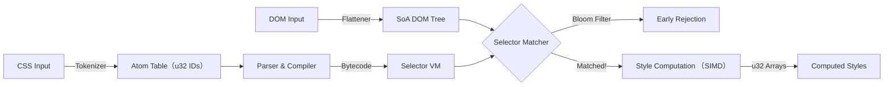

# Zig-css-engine: The Hyper-Fast CSS Engine
Zing is an experimental, high-performance CSS selector matching and style computation engine written in Zig.
It targets WebAssembly to deliver bare-metal performance for style resolution, completely bypassing the overhead of traditional object-oriented browser engines.
> Philosophy: "Pointers are cache poison. Objects are bloated. Everything is an array."
> 

⚡ Core Concept
既存のブラウザエンジン（Blink/Webkit）は汎用性を重視しており、複雑なC++クラス継承とポインタの追跡（Pointer Chasing）によってCPUキャッシュミスを多発させます。
Zing は Data-Oriented Design (DoD) を徹底し、CSSOMとDOMツリーを「巨大な整数の配列」として扱います。
 * No Pointers: 全ての参照は u32 のインデックス。
 * No Strings: 全ての文字列はパース時に AtomID (整数) に変換。
 * No Garbage: Arena Allocatorによる一括メモリ管理。

🏗 Architecture: "The Flat Engine"
Zingは、Wasmの線形メモリ（Linear Memory）を極限まで効率的に使う設計になっています。


1. Structure of Arrays (SoA)
Zigの std.MultiArrayList を活用し、プロパティごとにメモリを連続させます。
```
// Zing's DOM Node (Concept)
const FlatDOM = struct {
    parent_ids: ArrayList(u32),
    tag_ids: ArrayList(AtomID),
    class_bits: ArrayList(BloomFilter), // Ancestor filters
    // ...
};
```

2. Bloom Filter Matching
各DOMノードは、「自分と親が持っているクラス/ID」のハッシュ情報を Bloom Filter (64bit integer) として保持します。
セレクタのマッチングを行う前に、ビット演算 (node.filter & selector.mask == selector.mask) を一回行うだけで、マッチしない99%の要素をO(1)で却下します。

3. Bytecode VM
CSSセレクタ（例: div.container > span:hover）は、再帰的な関数呼び出しではなく、独自のバイトコード命令列にコンパイルされ、スタックマシン上で実行されます。

🛠 Tech Stack
 * Language: Zig (Latest Stable)
 * Target: wasm32-freestanding / wasm32-wasi
 * SIMD: @Vector(4, f32) for color/geometry math
 * Memory: Arena Allocator & Stack Fallback

🗺 Roadmap

Phase 1: The Atomizer & Tokenizer
 * [ ] 文字列（タグ名、プロパティ名）を u32 IDに変換する AtomTable の実装。
 * [ ] Comptime Phf: 頻出するCSSキーワード（display, block 等）をコンパイル時に完全ハッシュ関数化する。

Phase 2: The Flat DOM
 * [ ] ポインタを使わない、インデックスベースの木構造 (FlatTree) の定義。
 * [ ] JS (Browser) からDOM構造をシリアライズしてWasmに渡すインターフェース。

Phase 3: The Matcher (The Beast)
 * [ ] CSSセレクタパーサの実装。
 * [ ] セレクタをバイトコードへコンパイル。
 * [ ] Bloom Filter 生成ロジックの実装（DOM構築時に計算）。
 * [ ] VMの実装とマッチングテスト。

Phase 4: Style Computation
 * [ ] Cascade (優先順位) のソートロジック。
 * [ ] 値の継承（Inheritance）の計算。
 * [ ] SIMD を使った数値（px, %, color）の演算。

🚀 Getting Started
Build for Wasm
# Build optimized Wasm binary
zig build-lib src/main.zig -target wasm32-freestanding -O ReleaseFast

Usage (Conceptual JS API)
import { ZigEngine } from "./zing.wasm";

// 1. Initialize
const engine = await ZigEngine.init();

// 2. Load CSS (Parsed into bytecode internally)
engine.loadCSS(`
    .container { display: flex; }
    .item { color: red; }
`);

// 3. Feed Flat DOM (Int32Arrays)
// [id, parentId, tagId, ...]
engine.feedDOM(domArrays);

// 4. Compute! (Returns style pointers)
const styles = engine.compute(); 

🤝 Contribution
We are looking for low-level performance junkies.
If you love bit-twiddling, cache-line optimization, and hate garbage collection, join us.
License
MIT License

